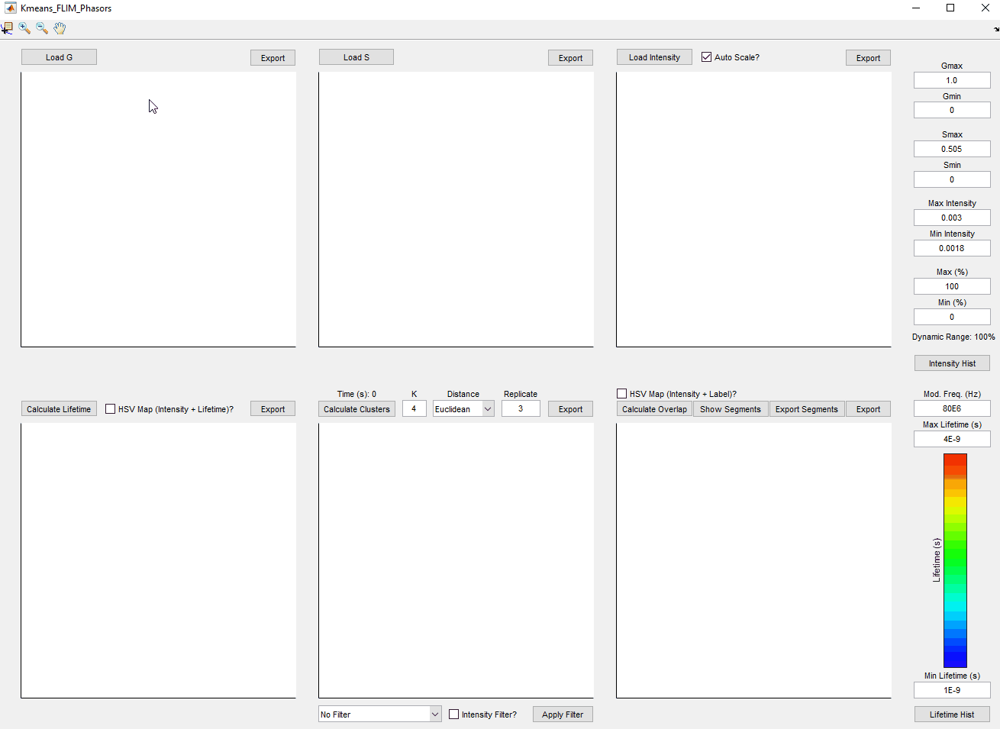
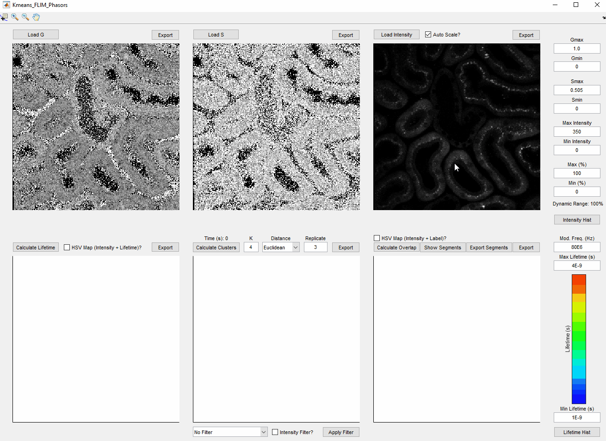
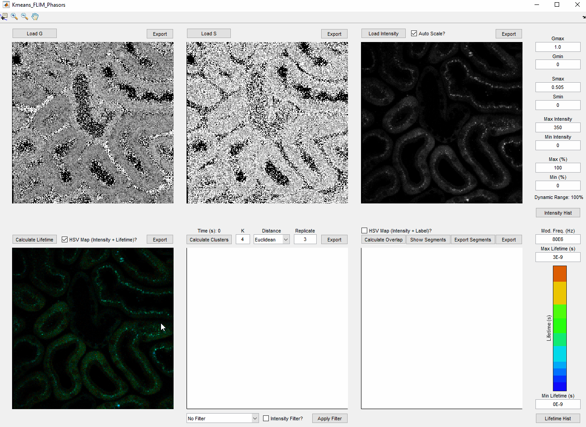
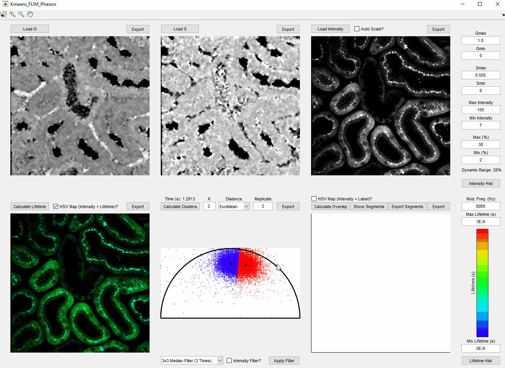
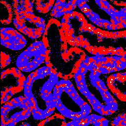
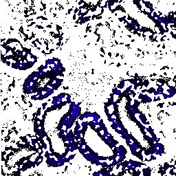
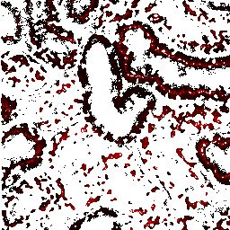

# Kmeans-FLIM-Phasors

This is the repository for the open-source program described in 
>[Y. Zhang et al., “Automatic segmentation of intravital fluorescence microscopy images by K-means clustering of FLIM phasors,” Opt. Lett., 2019.](https://www.osapublishing.org/DirectPDFAccess/E13D0D36-C32E-9AF5-30CAF2B414B89A7D_ads369247.pdf?da=1&adsid=369247&journal=3&seq=0&mobile=no)
```latex
@article{Zhang2017,
  author = {Zhang, Yide and Hato, Takashi and Dagher, Pierre C. and Nichols, Evan L. and Smith, Cody J. and Dunn, Kenneth W.  and Howard, Scott S.},
  journal = {Optics Letters},
  title = {{Automatic segmentation of intravital fluorescence microscopy images by K-means clustering of FLIM phasors}},
  year = {2019}
}
```


## Installation
### Option 1
- **This option requires a Matlab license**
- Install [Matlab](https://www.mathworks.com/products/matlab.html) on your computer
- Clone this repository:
```
git clone https://github.com/yzhang34/Kmeans-FLIM-Phasors.git
```
- Run the file 'Kmeans_FLIM_Phasors.m' with Matlab

### Option 2
- **This option does not require a Matlab license**
- Execute "MyAppInstaller_web.exe" in the "installer" directory
- Follow the instructions to install the program
- Matlab running environment will be automatically downloaded and installed
- Once the installation is complete, the program can be started with the icon on your Desktop

## Example
- Load the phasor (G, S) and intensity files into the program. Supported formats include TIFF and CSV files.


- Specify the excitation modulation frequency (default=80 MHz) and calcuate fluorescence lifetimes. HSV mapping (with intensity image) can be selected to form a composite image. Lifetime ranges can be defined.


- Apply filters to phasor images (G and S) only (unclick 'Intensity Filter?'). Adjust the intensity display range. Lifetime image can be recalculated to refect the intensity change.


- Specify K-means clustering paramters: K, distance metric, and replicate times. Perform the clustering algorithm.


- Obtain the segmentation result by calculating the overlapping pixels corresponding to the clustered phasors. The segmented images can be shown separately. All the images in the program, including the segmented images, can be exported.


- As an example, the overlap image, as well as the separate segmented images, can be exported as TIFF files:




## Applications
- Save the phasor and intensity images to TIFF or CSV files with your exisiting FLIM system.
- Import the data into the program following the instructions in the example above.


## License & Copyright
© 2019 Yide Zhang, University of Notre Dame

Licensed under the [Apache License 2.0](LICENSE)
